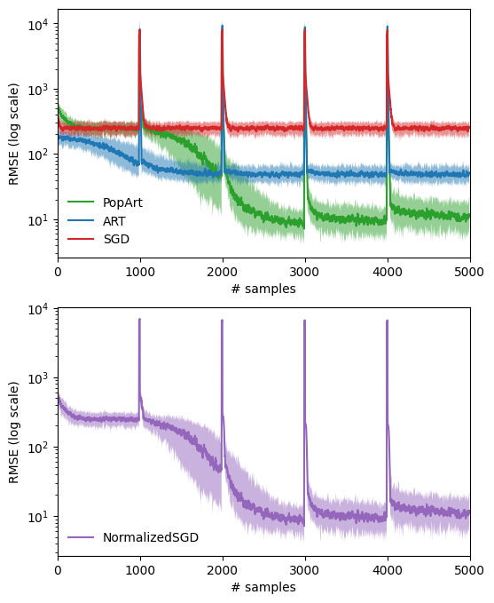

Pop-Art paper by DeepMind 
=========================================

About
------
Reproducing the example from the paper [1] ([tribute](https://github.com/zouyu4524/Pop-Art-Translation)).

In addition, we compare Normalized SGD to Pop-Art SGD; while the former uses gradient rescaling and the latter is based on rescaling
weights, the two are equivalent in case of squared loss.



Run
------
To build the Docker image and run the example, use
```
make run
```

References
-----------
<a id="1">[1]</a>
Hasselt et al. 
*Learning values across many orders of magnitude.*
NIPS 2016.

